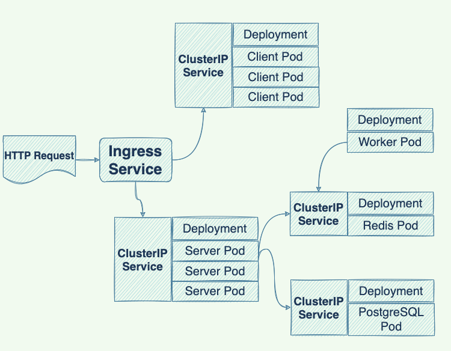
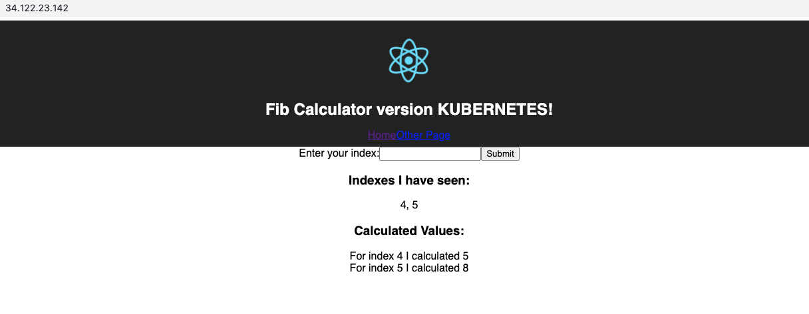

# Deploy a Kubernetes cluster to Google Cloud

The design of the application is similar to [multi-container docker application](https://github.com/yijunge/multi-container-docker). The code for building React, NodeJS, Redis and PostgreSQL docker images are reused.

|  |
|:--:|
|*Kubernetes Workflow  Diagram*|

The workflow for building a Kubernetes cluster and deploying the application to Google Cloud is shown in the above diagram.

The client and server deployment each maintain 3 identical pods and the worker, Redis and Postgres deployment each maintain 1 copy of pod.  

The client pod, server pod, worker pod, Redis pod and Postgres pod contain a React front-end container, Express server container, a NodeJS logic container, a Redis container and a Postgres container.

The communication between pods are enabled by the ClusterIP services objects which are responsible for setting up networking in a Kubernetes cluster.

The connection between the outside world and the Kubernetes cluster is through the Nginx ingress service which routes the incoming traffic to appropriate services inside the Kubernetes cluster.

The deployment process involves the following steps:

1. Create a new google cloud project and a Kubernetes cluster.

2. Create a service account for the Google cloud project created in step 1 and give the service account a role of container.viewer by using the following command:
<pre>
<code>
   gcloud projects add-iam-policy-binding project-ID
   --member=serviceAccount:service_account_email
   --role=roles/container.viewer
</code>
</pre>

3. Generate a service account key in json file format and <strong>encrypt</strong> the key with Travis CLI.

4. Configure .travis.yml file.

5. Commit the changes and deploy the application.

The deployed application on Google cloud looks like this:

|  |
|:--:|
|*Screenshot of the application deployed to Google Cloud*|
